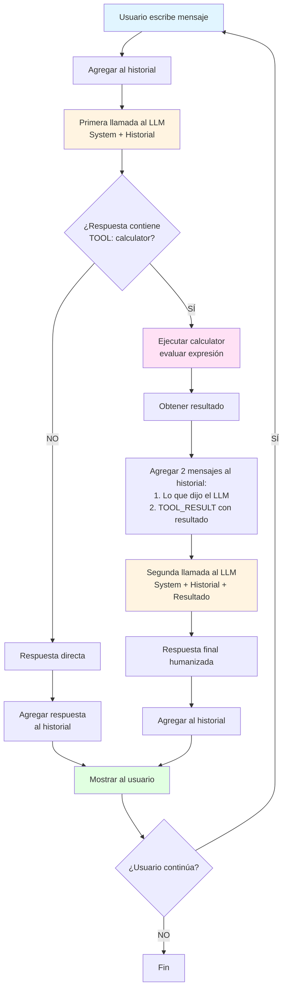

# Start Here - Primer Agente

Objetivo: Crear un 'hello world' de agente con Ollama.

## Que se construyó

Un agente simple que:
1. Recibe preguntas matematicas en lenguaje natural
2. Decide si necesita usar la calculadora
3. Ejecuta el calculo y responde

## Setup

Desde la raiz del repositorio:

```bash
# Instalar dependencias
uv sync

# Verificar que Ollama esta corriendo
ollama list
```

## Ejecutar

```bash
uv run hello-agent.py
```

## Como funciona

### Arquitectura

- **LLM**: llama3.1 local via Ollama
- **Tool**: Función de calculadora que el agente puede llamar
- **Protocolo**: Tool calling nativo con formato explícito (TOOL: / INPUT:)
- **Memoria**: Historial de conversación completo

### Flujo del Agente



### Ejemplo de Flujo Completo

**Input del usuario:** "Cuánto es 34 * 21?"

```
1. Historial después de agregar input:
[
  {"role": "user", "content": "Cuánto es 34 * 21?"}
]

2. Primera llamada al LLM → Responde:
"Voy a calcular eso.
TOOL: calculator
INPUT: 34 * 21"

3. Se detecta tool call → Ejecutar calculator("34 * 21") → "714"

4. Historial actualizado:
[
  {"role": "user", "content": "Cuánto es 34 * 21?"},
  {"role": "assistant", "content": "Voy a calcular...\nTOOL: calculator..."},
  {"role": "user", "content": "[TOOL_RESULT] calculator: 714"}
]

5. Segunda llamada al LLM → Ve el resultado y responde:
"El resultado de 34 * 21 es 714"

6. Mostrar al usuario
```

- El LLM decide cuando usar la tool basado en tu pregunta
- El agente mantiene el contexto de la conversación para respuestas mas naturales
- Se puede limpiar el contexto o salir en cualquier momento
