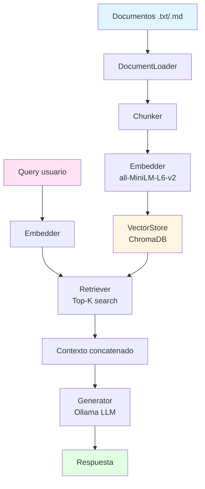

# Mission 02: RAG System

Sistema de Retrieval-Augmented Generation para consulta de documentos.

## Que se construyo

Un sistema RAG completo que permite hacer preguntas sobre documentos de texto.

1. **Ingestion**: Carga y procesa archivos .txt y .md
2. **Chunking**: Divide documentos en fragmentos semanticos
3. **Embeddings**: Convierte texto a vectores usando modelo local
4. **Vector Store**: Almacena vectores en ChromaDB
5. **Retrieval**: Busca documentos relevantes para cada query
6. **Generation**: Genera respuestas usando Ollama con contexto recuperado

## Setup

Desde la raiz del repositorio:

```bash
# Instalar dependencias globales (incluye chromadb, sentence-transformers)
uv sync

# Verificar Ollama
ollama list
```

## Ejecutar

```bash
# Modo interactivo
uv run src/rag_system.py

# O usar como libreria
uv run python -c "
from src.rag_system import RAGSystem
rag = RAGSystem()
rag.ingest_documents()
print(rag.query('Que son las list comprehensions?'))
"
```

## Como funciona

### Arquitectura



### Flujo de datos

1. **Ingestion**: Documentos se cargan, dividen en chunks y se almacenan con embeddings
2. **Query**: La pregunta se convierte a embedding y se buscan chunks similares
3. **Generation**: El LLM recibe pregunta + contexto y genera respuesta

### Componentes principales

**DocumentLoader**: Carga archivos .txt y .md con manejo de encoding (utf-8/latin-1)

**Chunker**: Estrategia jerarquica - parrafos primero, oraciones si son muy largos. Overlap configurable entre chunks.

**Embedder**: Modelo all-MiniLM-L6-v2 (384 dimensiones). Embeddings locales sin APIs externas.

**VectorStore**: ChromaDB con persistencia en disco. Busqueda por similitud coseno.

**Retriever**: Recupera top-k chunks mas relevantes para cada query.

**Generator**: Construye prompt con contexto y genera respuesta via Ollama.

## Tests

```bash
# Todos los tests
uv run pytest tests/

# Con coverage
uv run pytest --cov=src tests/

# Test especifico
uv run pytest tests/test_loader.py
```
